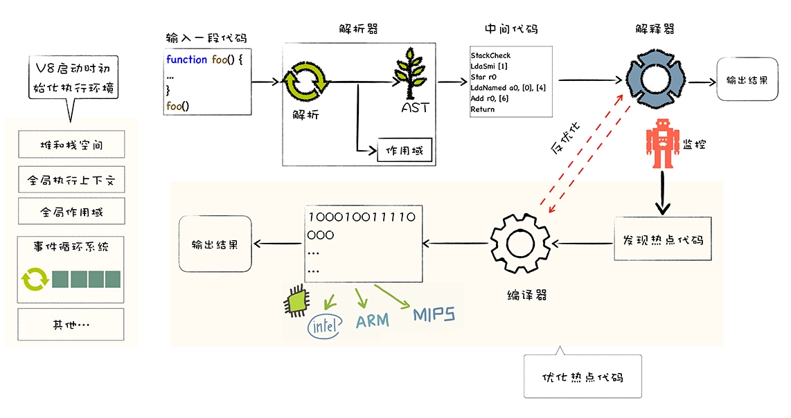

## 什么是V8  
V8是由Google开发的开源Javascript引擎, 目前用在Chrome浏览器和Node.js中, 其核心功能是执行易于人类理解的Javascript代码  

### V8如何执行javascript代码  
**核心流程分为编译和执行**
1. 将Javascript代码转换为低级中间代码或者机器能够理解的机器代码;
2. 执行转换后的代码并输出执行结果;  
  

## 高级代码为什么需要先编译再执行  
**1. CPU如何执行机器代码**  
可以把CPU看成是一个非常小的运算机器, 我们可以通过二进制的指令和cup进行沟通;比如, 我们给cpu发出‘10000100111011000’的二进制指令, 这条指令的意思是将一个寄存器中的数据移动到另外一个寄存器中, 当处理器执行到这条指令的时候, 便会按照指令的意思去实现相关的操作.  
为了能够完成复杂的任务, 工程师们为CPU提供了一大堆指令, 来实现各种功能, 我们就把这一大堆指令称为**指令集(Instructions)**, 也就是**机器语言**.  

由于CPU只能识别二进制指令, 但是二进制代码难以阅读和记忆, 于是我们又将二进制指令集转换为人类可以识别和记忆的符号, 这就是**汇编指令集**.  

**2. CPU能直接识别汇编语言吗**  
不能. 汇编语言编写的代码须臾奥使用汇编编译器, 将汇编代码编程成机器代码.  

汇编语言需要了解和处理架构相关的硬件知识, 比如需要使用寄存器、内存、操作CPU等; 但我们在编写应用的时候, 只想专心处理业务逻辑, 并不想要过多地理会这些处理器架构相关的细节.  
因此我们需要一种屏蔽了计算机架构细节的语言, 能适应多种不同的CPU架构的语言, 能专心处理业务逻辑的语言, 诸如C、C++、C#、Python、JavaScript等, 这些高级语言;  

和汇编语言一样, 处理器也不能直接识别由高级语言, 通常需要以下两种方式来执行代码:   
1. **解释执行:**需要先将输入的源代码通过**解析器编译**成中间代码, 之后直接使用**解释器解释执行中间代码**, 最后输出结果;  

2. **编译执行:** 先将源代码转换为中间代码, 然后编译器再将中间代码编译成机器代码.通常编译成的机器代码是以二进制文件形式存储的, 需要执行这段程序的时候直接执行二进制文件. 还可以使用虚拟机将编译后的机器代码保存在内存中, 然后直接执行内存中的二进制代码.  
;  

**V8如何执行javascript代码**
V8没有采用某种单一的技术, 而是混合编译执行和解释执行两种手段; 我们把这种混合编译器和解释器的技术成为**JIT(Just In Time)**技术.  
解释执行的启动速度快, 但是执行速度慢, 而编译执行的启动速度慢, 但是执行速度快  

**主要流程**
1. 初始化基础环境  
- 全局执行上下文: 包含了执行过程中的全局信息, 比如一些内置函数、全局变量等信息;  
- 全局作用域: 包含了一些全局变量, 在执行过程中的数据都要存放在内存中;  
- v8采用了经典的堆和栈的内存管理模式, 所以v8还需要初始化内存中的堆和栈结果;
- 为了让v8系统活起来, 需要初始化消息循环系统, 消息循环系统包含了消息驱动器和消息队列, 它如同V8的心脏, 不断接受消息并决策如何处理消息;  
2. 解析源码生成AST和作用域  
v8接收到要执行的js源代码, 对v8来说是一堆字符串, v8并不能直接理解这段字符串的含义, 它需要**结构化**这段字符串.结构化, 是指信息经过分析后可分解成多个互相关联的组成部分, 各组成部分有明确的层次结构, 方便使用和维护, 并有一定的操作规范.  
V8源代码结构化之后, 生成了抽象语法树(AST), AST是便于V8理解的结构; 在生成AST的同时, 

